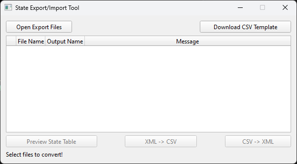
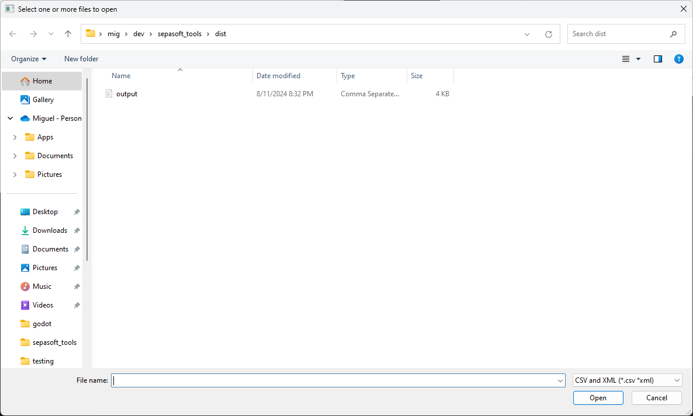
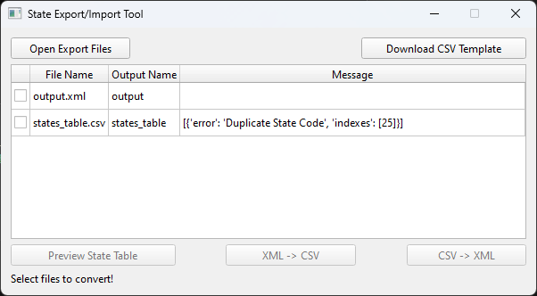

# State Export and Import Tool

The State Export and Import Tool is a user friendly GUI application to update/create Sepasoft state classes. As an end user it is difficult to do mass updates to state classes from the Equipment Manager and even more dificult to update the files using the XML export. This tool takes a Sepasoft state table export convert it to an easier to use csv format for updating. After updating a user the csv file the user can create a new XML for importing the state class. The tool also performs validation for common issues that occur during updates.

## Quick Start
1. Download the **single file executable** from the [Releases](https://github.com/migsolis/state_export_import_tool/releases)

2. Open state class export files or csv state tables

3. Open files are converted into state table objects and test for common errors

4. Click select a row and press the Preview... button at the bottom left to preview the state table

5. Check the box in the first column of a row to convert files. Multiple files of the same type can be converted at once.  
***Note:*** Selecting different file types disables conversion buttons

